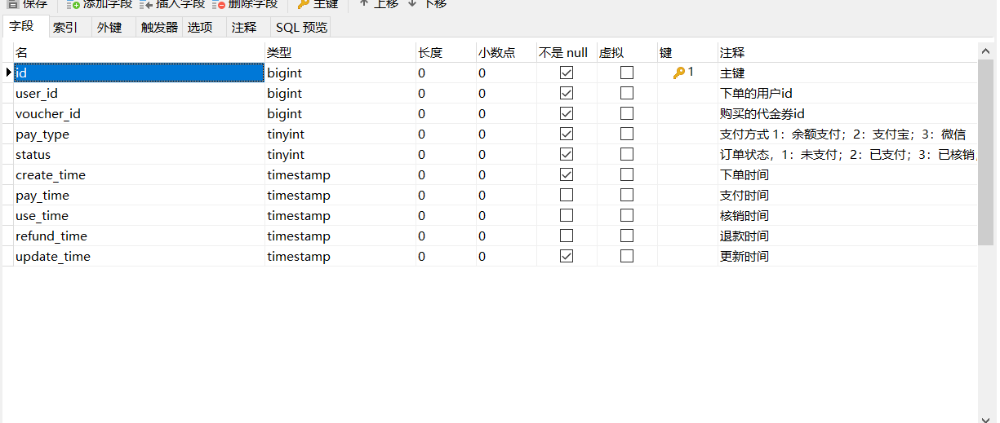
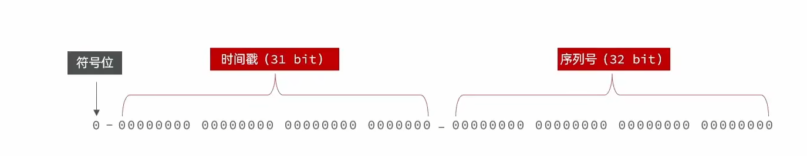

# 分布式id

## 自增id出现的问题

当用户抢购时，就会生成订单并保存到tb_voucher_order这张表中，而订单表如果使用数据库自增ID就存在一些问题：



* id的规律性太明显
* 受单表数据量的限制


场景分析：如果我们的id具有太明显的规则，用户或者说商业对手很容易猜测出来我们的一些敏感信息，比如商城在一天时间内，卖出了多少单，这明显不合适。

场景分析二：随着我们商城规模越来越大，mysql的单表的容量不宜超过500W，数据量过大之后，我们要进行拆库拆表，但拆分表了之后，他们从逻辑上讲他们是同一张表，所以他们的id是不能一样的， 于是乎我们需要保证id的唯一性。

## 技术选型

全局唯一id的方案选择：

**uuid** ：实现简单能确保唯一性，高可用性，但是不能保证顺序性，ID过长会导致存储和索引效率低下。

+ **工作原理**：UUID是通过一系列算法生成的128位数字，通常基于时间戳、计算机硬件标识符、随机数等元素。
+ **优点**：实现简单，无需网络交互，保证了ID的全球唯一性。
+ **缺点**：通常不能保证顺序性，ID较长，可能导致存储和索引效率低下。同时，基于MAC地址生成UUID的算法可能会造成MAC地址泄露。

**机器号+数据库自增**：不能满足高并发需求。

+ **工作原理**：

1. **机器号分配**：每台参与分布式系统的机器都会分配到一个唯一的机器号。这个机器号可以是基于机器的硬件信息（如MAC地址）生成的哈希值，或者是某个事先分配好的唯一编号。机器号的作用是确保在同一时间点上，不同机器生成的ID不会因自增部分而冲突。
2. **数据库自增**
3. **ID生成**：生成ID时，将机器号和当前数据库自增的数值组合起来。通常，机器号会作为ID的前缀，而数据库自增的数值则作为ID的后缀。

+ **优点**：实现简单，无需网络交互，保证了ID的全局唯一性，且顺序性。
+ **缺点**：在高并发场景下，数据库可能成为性能瓶颈。**单点故障风险**：如果数据库成为系统的单点故障，那么ID的生成也会受到影响。

**redis生成**：INCRBy生成自增。能保证顺序性，唯一性，高性能，高可用，但是占用带宽。

+ **工作原理**：利用Redis的原子操作（如INCR和INCRBY）来生成唯一的递增数值。
+ **优点**：快速、简单且易于扩展；支持高并发环境；不依赖于数据库。
+ **缺点**：依赖于外部服务（Redis），需要管理和维护额外的基础设施。同时，每次生成ID都需要向Redis进行请求，占用带宽。

**Snowflake（雪花算法）**：

1. + **工作原理**：Twitter开发的一种生成64位ID的服务，基于时间戳、节点ID和序列号。时间戳保证了ID的唯一性和顺序性，节点ID保证了在多机环境下的唯一性。

   1. **时间戳部分**：雪花算法中的ID包含了一个41位的时间戳部分（精确到毫秒级），这使得算法能够支持长达69年的唯一性。由于时间戳是递增的，因此生成的ID在整体上也会按照时间顺序递增。
   2. **序列号部分**：在同一毫秒内，如果有多个ID生成请求，雪花算法会通过序列号部分来区分这些ID。序列号是一个12位的计数顺序号，支持每个节点每毫秒产生4096个唯一的ID序号。这确保了即使在同一毫秒内，生成的ID也是唯一的，并且由于时间戳的递增性，这些ID在整体上仍然保持自增排序。

   + **优点**：ID有时间顺序，长度适中，生成速度快。
   + **缺点**：对系统时钟有依赖，时钟回拨会导致ID冲突。


## 实现


因为我们是订单，首先要满足的就是高可用，高性能，然后就是id是自增的为了数据库存储索引以及查询的效率。那么满足条件的就是雪花算法和redis生成。

参考雪花算法利用redis 生成。

为了增加ID的安全性，我们可以不直接使用Redis自增的数值，而是拼接一些其它信息：




成部分：符号位：1bit，永远为0

时间戳：31bit，以秒为单位，可以使用69年

序列号：32bit，秒内的计数器，支持每秒产生2^32个不同ID


序列号：需要注意的是，redis的自增是64位，但是只能存下32位

所以我们不能只使用一个key，然后一直让他自增，可能会超过上限

我们通常使用天来拼接key，一天一个key，这样不仅解决了超上限的问题，也方便统计。


写成工具类

```java
/**
 * 生成全局唯一id
 *
 */
@Component
public class RedisIdWorker {
    //初始时间戳
    private  static final long BEGIN_TIMESTAMP = 1722470400L;

    /**
     * 序列号的位数
     */

    private static final int COUNT_BITS = 32;
    @Resource
    private StringRedisTemplate stringRedisTemplate;

    /**
     * 创建全局唯一id
     * @param keyPrefix
     * @return
     */
    public long nextId(String keyPrefix){

        //生成时间戳
        LocalDateTime now = LocalDateTime.now();
        long nowSecond = now.toEpochSecond(ZoneOffset.UTC);
        long timestamp = nowSecond - BEGIN_TIMESTAMP;

        //生成序列号
        String date = now.format(DateTimeFormatter.ofPattern("yyyy:MM:dd"));
        long count = stringRedisTemplate.opsForValue().increment("icr:" + keyPrefix + ":" + date);

        //拼接并返回
        return timestamp<<COUNT_BITS |count;

    }

    /**
     * 获取初始时间 秒
     * @param args
     */
//    public static void main(String[] args) {
//        LocalDateTime localDateTime = LocalDateTime.of(2024, 8, 1, 0, 0, 0);
//
//        long second = localDateTime.toEpochSecond(ZoneOffset.UTC);
//        System.out.println("second = " + second);
//
//
//    }

}

```

