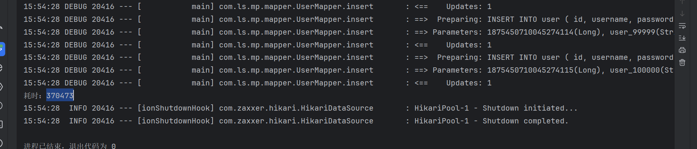
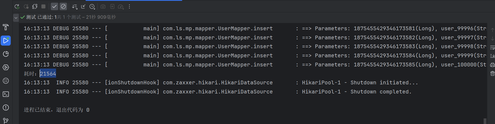
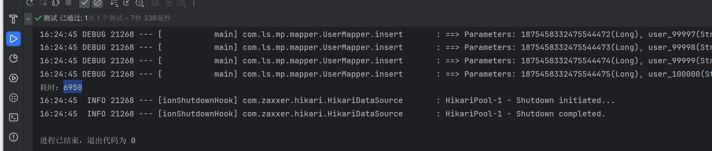

### **批量插入**

IService中的批量新增功能使用起来非常方便，但有一点注意事项，我们先来测试一下。 首先我们测试逐条插入数据：

```java
@SpringBootTest
class UserControllerTest {
    @Autowired
    private  UserService userService;
    @Test
    void testSaveOneByOne() {
        long b = System.currentTimeMillis();
        for (int i = 1; i <= 100000; i++) {
            userService.save(buildUser(i));
        }
        long e = System.currentTimeMillis();
        System.out.println("耗时：" + (e - b));
    }

    private User buildUser(int i) {
        User user = new User();
        user.setUsername("user_" + i);
        user.setPassword("123");
        user.setPhone("" + (18688190000L + i));
        user.setBalance(2000);
        user.setInfo("{\"age\": 24, \"intro\": \"英文老师\", \"gender\": \"female\"}");
        user.setCreateTime(LocalDateTime.now());
        user.setUpdateTime(user.getCreateTime());
        return user;
    }

}
```

插入10w条数据，用时370s，每次插入都要一次网络连接数据库。



用批处理

```java
@SpringBootTest
class UserControllerTest {
    @Autowired
    private  UserService userService;
    @Test
    void testSaveOneByOne() {
        long b = System.currentTimeMillis();
        for (int i = 1; i <= 100000; i++) {
            userService.save(buildUser(i));
        }
        long e = System.currentTimeMillis();
        System.out.println("耗时：" + (e - b));
    }

    private User buildUser(int i) {
        User user = new User();
        user.setUsername("user_" + i);
        user.setPassword("123");
        user.setPhone("" + (18688190000L + i));
        user.setBalance(2000);
        user.setInfo("{\"age\": 24, \"intro\": \"英文老师\", \"gender\": \"female\"}");
        user.setCreateTime(LocalDateTime.now());
        user.setUpdateTime(user.getCreateTime());
        return user;
    }

    @Test
    void testSaveBatch() {
        long b = System.currentTimeMillis();
        List<User> list = new ArrayList<>(1000);
        for (int i = 1; i <= 100000; i++) {
                list.add(buildUser(i));
                if (i % 1000 == 0) {
                    userService.saveBatch(list);
                    list.clear();
                }
        }
        long e = System.currentTimeMillis();
        System.out.println("耗时：" + (e - b));
    }
}
```

执行耗时，21s。每1000条数据进行一次网络连接。耗时少




可以看到使用了批处理以后，比逐条新增效率提高了10倍左右，性能还是不错的。

不过，我们简单查看一下`MybatisPlus`源码：

```Java
@Transactional(rollbackFor = Exception.class)
@Override
public boolean saveBatch(Collection<T> entityList, int batchSize) {
    String sqlStatement = getSqlStatement(SqlMethod.INSERT_ONE);
    return executeBatch(entityList, batchSize, (sqlSession, entity) -> sqlSession.insert(sqlStatement, entity));
}
// ...SqlHelper
public static <E> boolean executeBatch(Class<?> entityClass, Log log, Collection<E> list, int batchSize, BiConsumer<SqlSession, E> consumer) {
    Assert.isFalse(batchSize < 1, "batchSize must not be less than one");
    return !CollectionUtils.isEmpty(list) && executeBatch(entityClass, log, sqlSession -> {
        int size = list.size();
        int idxLimit = Math.min(batchSize, size);
        int i = 1;
        for (E element : list) {
            consumer.accept(sqlSession, element);
            if (i == idxLimit) {
                sqlSession.flushStatements();
                idxLimit = Math.min(idxLimit + batchSize, size);
            }
            i++;
        }
    });
}
```

可以发现其实`MybatisPlus`的批处理是基于`PrepareStatement`的预编译模式，然后批量提交，最终在数据库执行时还是会有多条insert语句，逐条插入数据。SQL类似这样：

```SQL
Preparing: INSERT INTO user ( username, password, phone, info, balance, create_time, update_time ) VALUES ( ?, ?, ?, ?, ?, ?, ? )
Parameters: user_1, 123, 18688190001, "", 2000, 2023-07-01, 2023-07-01
Parameters: user_2, 123, 18688190002, "", 2000, 2023-07-01, 2023-07-01
Parameters: user_3, 123, 18688190003, "", 2000, 2023-07-01, 2023-07-01
```

而如果想要得到最佳性能，最好是将多条SQL合并为一条，像这样

```SQL
INSERT INTO user ( username, password, phone, info, balance, create_time, update_time )
VALUES 
(user_1, 123, 18688190001, "", 2000, 2023-07-01, 2023-07-01),
(user_2, 123, 18688190002, "", 2000, 2023-07-01, 2023-07-01),
(user_3, 123, 18688190003, "", 2000, 2023-07-01, 2023-07-01),
(user_4, 123, 18688190004, "", 2000, 2023-07-01, 2023-07-01);
```

MySQL的客户端连接参数中有这样的一个参数：`rewriteBatchedStatements`。顾名思义，就是重写批处理的`statement`语句。

这个参数的默认值是false，我们需要修改连接参数，将其配置为true

修改项目中的application.yml文件，在jdbc的url后面添加参数`&rewriteBatchedStatements=true`:

```YAML
spring:
  datasource:
    url: jdbc:mysql://127.0.0.1:3306/mp?useUnicode=true&characterEncoding=UTF-8&autoReconnect=true&serverTimezone=Asia/Shanghai&rewriteBatchedStatements=true
    driver-class-name: com.mysql.cj.jdbc.Driver
    username: root
    password: MySQL123
```

再次执行批处理

